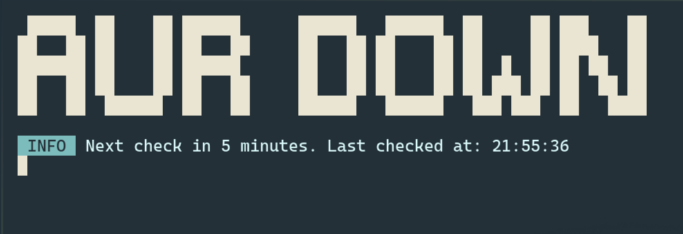

# AUR Status Checker

This is a simple Go application that continuously checks the status of the Arch User Repository (AUR) and displays it in the terminal.



## Prerequisites

- Go programming language installed on your system.

## Installation and Usage

1.  **Clone the repository or download the source code.**

2.  **Navigate to the project directory:**

    ```bash
    cd aur-up
    ```

3.  **Tidy the dependencies:**

    ```bash
    go mod tidy
    ```

4.  **Run the application:**

    ```bash
    go run main.go
    ```

## Building the application

To build the application into a single executable, run the following command:

```bash
go build -o aur-up main.go
```

This will create an executable file named `aur-up` in the current directory.

## Installing to /usr/local/bin

After building the application, you can move it to `/usr/local/bin` to make it available system-wide:

```bash
sudo mv aur-up /usr/local/bin/
```

You can then run the application from anywhere by simply typing `aur-up` in your terminal.